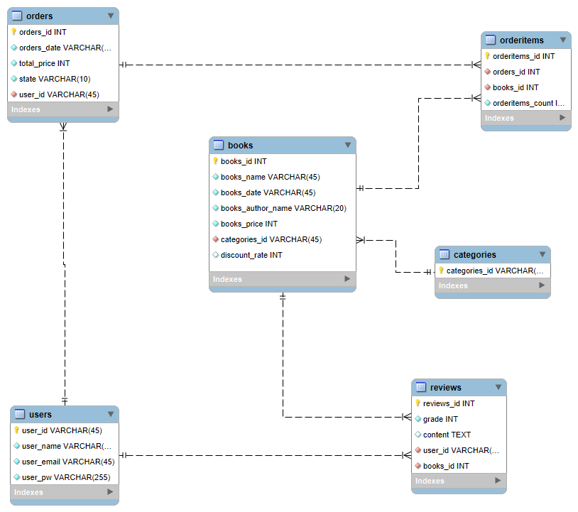

# 온라인 서점 프로젝트

## 프로젝트 소개

이 프로젝트는 온라인 서점을 위한 REST API 백엔드 시스템입니다. 사용자들은 책을 구매하고, 리뷰와 평점을 남길 수 있으며, 다양한 카테고리와 정렬 조건을 통해 책을 검색하고 추천 받을 수 있습니다. 할인 기능을 지원하며, 구매한 책의 배송 상태는 자동으로 업데이트됩니다. 

> **주요 기능**: 책 구매, 리뷰 및 평점 작성, 카테고리 별 조회 및 정렬, 추천 도서 제공, 할인 적용

## 기술 스택

- **Java**: 17 version
- **Spring Boot**: 3.3.5
- **JPA**
- **Database**: H2 (테스트용), MySQL
- **JWT**: 사용자 인증 및 권한 관리
- **Scheduler**: 책 구매 후 상태 변경 자동화

## ERD (데이터베이스 설계)



- **Users**: 사용자 정보 (사용자_Id, 이름, 이메일, 비밀번호 등)
- **Books**: 책 정보 (책_Id, 이름, 저자, 가격, 할인율, 카테고리, 등록일 등)
- **Categories**: 책 카테고리 정보
- **Orders**: 주문 정보 (주문정보_Id, 사용자 ID, 주문 날짜, 총액, 상태 등)
- **OrderItems**: 주문에 포함된 개별 책 정보 (주문_Id, 책_Id, 수량, 개별 가격 등)
- **Reviews**: 리뷰 정보 (리뷰_Id, 책_Id, 사용자_Id, 평점, 내용 등)

## 주요 기능 설명

### 1. 구매 기능

- **설명**: 사용자가 장바구니에 담은 책들을 구매할 수 있습니다. 구매 후, 상태는 자동으로 "배송 중", "발송 완료"로 변경됩니다.
- **API 예시**
  - `POST /orders`: 장바구니의 책을 구매로 전환합니다.
  - **스케줄러**: `@Scheduled` 어노테이션을 사용하여 구매 후 1일차에 "배송 중", 2일차에 "발송 완료"로 상태를 변경합니다.

### 2. 리뷰 및 평점 기능

- **설명**: 사용자는 구매한 책에 대해서만 리뷰와 평점을 남길 수 있으며, 사용자 당 하나의 리뷰만 작성 가능합니다.
- **API 예시**
  - `POST /books/{bookId}/reviews`: 책에 대한 리뷰와 평점을 남깁니다.

### 3. 유저 관리 기능

- **설명**: 사용자는 회원가입과 로그인을 통해 자신의 계정을 생성하고, JWT 토큰을 통해 인증 상태를 유지할 수 있습니다.
- **API 예시**
  - `POST /users/register`: 회원가입
  - `POST /users/login`: 로그인 및 JWT 토큰 발급

### 4. 할인 기능

- **설명**: 할인 중인 책은 할인율을 적용하여 표시됩니다.
- **API 예시**
  - `GET /books/discounts`: 현재 할인 중인 책 목록 조회

### 5. 책 조회 및 정렬 기능

- **설명**: 카테고리별 검색, 책 이름 및 저자명 검색, 등록일 기준 또는 가나다순으로 정렬 가능합니다.
- **API 예시**
  - `GET /books?category=...&sort=...`: 카테고리 및 정렬 조건에 따른 책 리스트 반환

### 6. 책 추천 기능

- **설명**: 신규로 등록된 책 또는 사용자가 자주 구매한 카테고리의 베스트셀러 책을 추천합니다.
- **API 예시**
  - `GET /books/recommend`: 신간 또는 카테고리별 베스트셀러 책 추천

## API 설계

| 메서드 | 엔드포인트                | 설명                           |
|--------|----------------------------|--------------------------------|
| POST   | /users/register            | 사용자 회원가입                |
| POST   | /users/login               | 로그인 및 JWT 발급             |
| POST   | /orders                    | 책 구매                        |
| GET    | /books/discounts           | 할인 중인 책 목록              |
| POST   | /books/{bookId}/reviews    | 책에 리뷰와 평점 남기기        |
| GET    | /books                     | 책 검색 및 정렬                |
| GET    | /books/recommend           | 책 추천                        |

## 프로젝트 설치 및 실행

1. **프로젝트 클론**
   ```bash
   git clone https://github.com/SeongJoon95/EbookStore-back.git
   ```

## Dependencies

이 프로젝트는 다음과 같은 주요 의존성을 포함하고 있습니다:

- Spring Web: 웹 개발을 위한 기본 기능 제공
- Spring Data JPA: 데이터베이스 연동과 ORM 기능 제공
- Lombok: 코드의 간결성을 위해 Getter, Setter, 생성자 등의 코드 자동 생성
- Validation: 데이터 검증 기능
- MySQL Driver: MySQL 데이터베이스 연결을 위한 드라이버
- Spring Security: 인증과 권한 관리를 위한 보안 기능
- OAuth2 Client: OAuth2 인증을 위한 클라이언트 설정